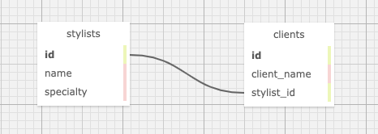

# Clearwater Salon Booking System

#### Chop, chop, chop

#### Melissa Schatz-Miller

<p align="center">
    
</p>

## Technologies Used

* _C#_
* _.NET 5_
* _NuGet_
* _ASP.NET Core_

## Description

_A custom booking webapp for the fictional, but peerless, Eau Claire's Salon. Users can add, edit, and delete stylists. List the name and specialty of each stylist, and then assign them clients._  
_Who hasn't always secretly desired such power?! The fate of all of our hair rests between the precarious blades of your scissors._  
_After setup [see instructions below], simply click around in the web interface to fulfill your small-business-owner dreams._


## Instructions

### Technology Requirements

* [.NET 5](https://dotnet.microsoft.com/download/dotnet/5.0)
* A text editor like [VS Code](https://code.visualstudio.com/)

### Setup/Installation


* Clone [this repository](https://github.com/tigertiger/HairSalon) to an empty folder or to your desktop, or download and open the Zip on your local machine  
    Instructions for cloning can be found [here](https://docs.github.com/en/github/creating-cloning-and-archiving-repositories/cloning-a-repository-from-github/cloning-a-repository).
* Open the HairSalon folder in your preferred text editor. We'll come back to this shortly.

* Create a SQL database:
  - Create a new ```appsettings.json``` file in your HairSalon/HairSalon folder
  - Copy the following code into that file, replacing YOUR_PASSWORD with your MySql password:
```
    {
      "ConnectionStrings": {
          "DefaultConnection": "Server=localhost;Port=3306;database=melissa_schatzmiller;uid=root;pwd=YOUR_PASSWORD;"
      }
    }
```
* Create a SQL database, continued:
  - Open a new terminal and run ```mysql -uroot -p<YOUR_PASSWORD>```
  - Open MySQL Workbench
  - Go to Navigator > Administration and select Data Import/Restore
  - In Import Options, select Import from Self-Contained File
  - Navigate to melissa_schatzmiller.sql
  - Under Default Schema to be Imported To, select New and enter melissa_schatzmiller as the name of the database. Click Ok!
  - Navigate to the Import Progress tab and click Start Import at the bottom right of the window
  - After finishing the steps above, reopen Navigator > Schemas. Right click and select Refresh All. The melissa_schatzmiller database should appear.  

* Return to HairSalon in your text editor
* Restore and build the project:
  - Navigate to the HairSalon/HairSalon folder in the command line or terminal  
    -- Run ```dotnet restore``` to restore the project dependencies  
    -- Run ```dotnet build``` to build and compile the project  

* Use the Web App:
  - Navigate to the HairSalon/HairSalon folder in the terminal
  - Run ```dotnet run``` 
  - If you would like to be able to continue viewing the site while making changes to its content, instead run ```dotnet watch run```
  - Access http://localhost:5000/ in your browser to view & interact with the web app

## Known Bugs

* _No known bugs at this time_

## License

_[GPL](https://opensource.org/licenses/gpl-license)_
_Copyright (c) 2021, Melissa Schatz-Miller_

## Contact Information  

Melissa Schatz-Miller <melissa.scmi@gmail.com>  
_Please feel free to reach out to me with suggested changes/improvements, or if you have any questions._

